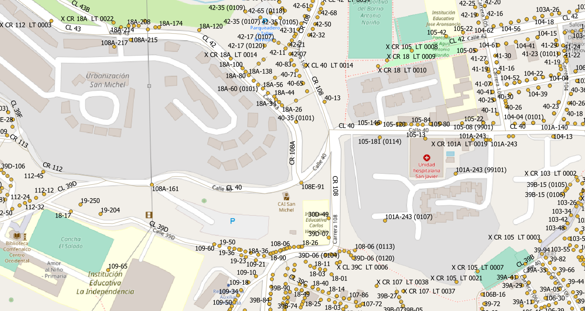

<aside>
<table align="right" style="padding: 1em">
<tr><td>Paquete <a target="_git" title="Enlace canónico a git para este paquete." href="https://git.digital-guard.org/preserv-CO/blob/main/data/ANT/Medellin/_pk0002.01"><big><b>pk0002.01</b></big></a> de <small><a target="_afacodes" title="Jurisdicción" href="https://afa.codes/CO-ANT-Medellin">CO-ANT-Medellin</a></small>
</td></tr>
<tr><td>
Donante: <a rel="external" target="_doador" href="https://www.medellin.gov.co/">Alcaldía de Medellín</a>
 &nbsp; <small>NIT 890.905.211-1</small> • Wikidata <a rel="external" target="_doador" title="Enlace del descriptor Wikidata del donante" href="https://www.wikidata.org/wiki/Q51716472">Q51716472</a></small> 
Licencia <a rel="external" target="_doador" href="https://www.medellin.gov.co/servicios/metadatos_gis/METADATO_CATASTRO/LICENCIA_ABIERTA_O_CONDICIONES_DE_USO_PARA_DATOS_ABIERTOS_CATASTRO_MEDELLIN_V1.pdf"><b></b></a> ( <a title="SHA256 92cf1923118d523b332a089aff689e4645c1c619c361be98787a4e529f37b989.zip" href="http://dl.digital-guard.org/92cf1923118d523b332a089aff689e4645c1c619c361be98787a4e529f37b989.zip"><code>92cf192...zip</code></a>) 
Obtido via <i>site</i> em <b>01/01/1900</b> por:
 &nbsp; Avaliação técnica: <a rel="external" target="_gitPerson" title="Usuario de Git" href="https://github.com/crebollobr">crebollobr</a>
 &nbsp; Representação institucional: <a rel="external" target="_gitPerson" title="Usuario de" href="https://github.com/ThierryAJean">ThierryAJean</a> 
</td></tr>
<tr><td>Camadas:   </td></tr>
<tr><td>Datos publicados en <a href="https://git.digital-guard.org/preservCutGeo-CO2021/tree/main/data/ANT/Medellin/_pk0002.01">preservCutGeo-CO2021</a> <a href="#reproducibilidad">Reproducible</a></td></tr>
<tr><td>Visualización:   </td></tr>
</table>
</aside>

<section>

Este repositorio de metadatos describe un paquete de archivos donados al dominio público. Está siendo conservado por Digital Guard: para obtener más detalles, consulte la [documentación sobre el proceso de registro y conservación](https://wiki.addressforall.org/doc/Documentação_Digital-guard).

Nota. Este documento README fue generado por software a partir de la información contenida en el archivo [`make_conf.yaml`](https://git.digital-guard.org/preserv-CO/blob/main/data/ANT/Medellin/_pk0002.01/make_conf.yaml) en este paquete, e información adicional de los catálogos de [donantes](https://git.digital-guard.org/preserv-BR/blob/main/data/donor.csv) y [paquetes](https://git.digital-guard.org/preserv-BR/blob/main/data/donatedPack.csv).

# Capas de datos

Los archivos contienen "capas de datos" temáticas. Los metadatos también describen cómo se evaluó cada capa y cómo se filtraron sus datos de forma estandarizada.

##  geoaddress

Nombre del archivo: `Nomenclatura_Domiciliaria` *Descarga* e integridad: [2630981b3e7c796f23a938d8c727ed47cf890547336ead89738b96e67fe62e7a.zip](http://dl.digital-guard.org/2630981b3e7c796f23a938d8c727ed47cf890547336ead89738b96e67fe62e7a.zip) Descripción: Nomenclatura Domiciliaria Tamaño del archivo: 33241186 bytes (31.7 <abbr title="mebibyte">MiB</abbr>) Formato: shp SRID: 4326

#### Datos relevantes
* `VIA` (via)

* `PLACA` (hnum)

* `NOMBRE_BAR` (nsvia)

#### Otros datos relevantes
* `TIPO_VIA`
* `TIPO_CRUCE`
* `NOMBRE_COM`
* `ORIENTACIO`
* `ORIENTAC_1`

#### Filtrado de resultados y su publicación
19929610 bytes (19.01 <abbr title="mebibyte">MiB</abbr>) 384911 pontos densidad media: 4220.5 pontos/km² GeoJSONs publicados em [https://git.digital-guard.org/preservCutGeo-CO2021/tree/main/data/ANT/Medellin/_pk0002.01/geoaddress](https://git.digital-guard.org/preservCutGeo-CO2021/tree/main/data/ANT/Medellin/_pk0002.01/geoaddress)

##  via

Nombre del archivo: `Malla_vial` *Descarga* e integridad: [410d02a87e8d2955849ba644ed8830f3d6761b31f4d0dbf044d39975ffc02be1.zip](http://dl.digital-guard.org/410d02a87e8d2955849ba644ed8830f3d6761b31f4d0dbf044d39975ffc02be1.zip) Descripción: Malla Vial Tamaño del archivo: 4202017 bytes (4.01 <abbr title="mebibyte">MiB</abbr>) Formato: shp SRID: 4326

#### Datos relevantes
* `Coalesce(NOMBRE_COM,LABEL)` (via)

#### Otros datos relevantes
* `LABEL`
* `NOMBRE_COM`

#### Filtrado de resultados y su publicación
6529686 bytes (6.23 <abbr title="mebibyte">MiB</abbr>) 40956 segmentos con 3327.98 <abbr title="quilômetros">km</abbr> densidad media: 16.12 segmentos/km² GeoJSONs publicados em [https://git.digital-guard.org/preservCutGeo-CO2021/tree/main/data/ANT/Medellin/_pk0002.01/via](https://git.digital-guard.org/preservCutGeo-CO2021/tree/main/data/ANT/Medellin/_pk0002.01/via)

# Evidencia de prueba

</section>
<section>

# Reproducibilidad

Consulte los detalles en [reproducibility.sh](https://git.digital-guard.org/preserv-CO/blob/main/data/ANT/Medellin/_pk0002.01/reproducibility.sh).

</section>

