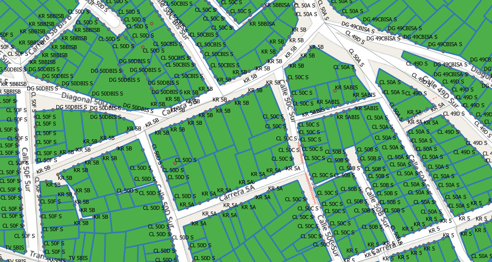

<aside>
<table align="right" style="padding: 1em">
<tr><td>Paquete <a target="_git" title="Enlace canónico a git para este paquete." href="https://git.digital-guard.org/preserv-CO/blob/main/data/DC/Bogota/_pk0001.01"><big><b>pk0001.01</b></big></a> de <small><a target="_afacodes" title="Jurisdicción" href="https://afa.codes/CO-DC-Bogota">CO-DC-Bogota</a></small>
</td></tr>
<tr><td>
Donante: <a rel="external" target="_doador" href="https://bogota.gov.co/">Alcaldia Mayor de Bogota D.C.</a>
 &nbsp; <small>NIT 899.999.061-9</small> • Wikidata <a rel="external" target="_doador" title="Enlace del descriptor Wikidata del donante" href="https://www.wikidata.org/wiki/Q51716465">Q51716465</a></small> 
Licencia <a rel="external" target="_doador" href="https://creativecommons.org/licenses/by/4.0/"><b>CC BY 4.0</b></a> (cc-by <a title="SHA256 64ebe2ba3cdf9a5171f020883d2d0246f2886a1daad171be1f3c4a5bf46e9386.zip" href="http://dl.digital-guard.org/64ebe2ba3cdf9a5171f020883d2d0246f2886a1daad171be1f3c4a5bf46e9386.zip"><code>64ebe2b...zip</code></a><a title="SHA256 http://web.archive.org/web/20210421104918/https://datosabiertos.bogota.gov.co/dataset/placa-domiciliaria" href="http://web.archive.org/web/20210421104918/https://datosabiertos.bogota.gov.co/dataset/placa-domiciliaria"><code>webarchive</code></a>) 
Obtido via <i>site</i> em <b>01/01/1900</b> por:
 &nbsp; Avaliação técnica: <a rel="external" target="_gitPerson" title="Usuario de Git" href="https://github.com/crebollobr">crebollobr</a>
 &nbsp; Representação institucional: <a rel="external" target="_gitPerson" title="Usuario de" href="https://github.com/ThierryAJean">ThierryAJean</a> 
</td></tr>
<tr><td>Camadas:     </td></tr>
<tr><td>Datos publicados en <a href="https://git.digital-guard.org/preservCutGeo-CO2021/tree/main/data/DC/Bogota/_pk0001.01">preservCutGeo-CO2021</a> <a href="#reproducibilidad">Reproducible</a></td></tr>
<tr><td>Visualización:     </td></tr>
</table>
</aside>

<section>

Este repositorio de metadatos describe un paquete de archivos donados al dominio público. Está siendo conservado por Digital Guard: para obtener más detalles, consulte la [documentación sobre el proceso de registro y conservación](https://wiki.addressforall.org/doc/Documentação_Digital-guard).

Nota. Este documento README fue generado por software a partir de la información contenida en el archivo [`make_conf.yaml`](https://git.digital-guard.org/preserv-CO/blob/main/data/DC/Bogota/_pk0001.01/make_conf.yaml) en este paquete, e información adicional de los catálogos de [donantes](https://git.digital-guard.org/preserv-BR/blob/main/data/donor.csv) y [paquetes](https://git.digital-guard.org/preserv-BR/blob/main/data/donatedPack.csv).

# Capas de datos

Los archivos contienen "capas de datos" temáticas. Los metadatos también describen cómo se evaluó cada capa y cómo se filtraron sus datos de forma estandarizada.

##  block

Nombre del archivo: `manz_shp/manz` *Descarga* e integridad: [ed072b0391d6c4a9bd76237b4ebb55de4f00ff0b73325d715d35baf29f41278e.zip](http://dl.digital-guard.org/ed072b0391d6c4a9bd76237b4ebb55de4f00ff0b73325d715d35baf29f41278e.zip) Descripción: Quadras Tamaño del archivo: 31839011 bytes (30.36 <abbr title="mebibyte">MiB</abbr>) Formato: shp SRID: 4686

#### Filtrado de resultados y su publicación
47194137 bytes (45.01 <abbr title="mebibyte">MiB</abbr>) 43944 polígonos con 283.97 <abbr title="quilômetros quadrados">km²</abbr> densidad media: 0.58 polígonos/km² GeoJSONs publicados em [https://git.digital-guard.org/preservCutGeo-CO2021/tree/main/data/DC/Bogota/_pk0001.01/block](https://git.digital-guard.org/preservCutGeo-CO2021/tree/main/data/DC/Bogota/_pk0001.01/block)

#### Visualización
[https://viz.addressforall.org/CO-DC-Bogota/_pk0001.01/block](https://viz.addressforall.org/CO-DC-Bogota/_pk0001.01/block)
##  geoaddress

Nombre del archivo: `pdom_shp/pdom` *Descarga* e integridad: [8585490fefe89ff086a9234b27232cda9e29df9ad0b63d19acbd43f3760d04b5.zip](http://dl.digital-guard.org/8585490fefe89ff086a9234b27232cda9e29df9ad0b63d19acbd43f3760d04b5.zip) Descripción: Ponto de Endereço Tamaño del archivo: 112604071 bytes (107.39 <abbr title="mebibyte">MiB</abbr>) Formato: shp SRID: 4686

#### Datos relevantes
* `PDOTEXTO` (hnum)

* `PDONVIAL` (via)

#### Otros datos relevantes
* `PDOCINTERI`
* `PDOTIPO`

#### Filtrado de resultados y su publicación
74014323 bytes (70.59 <abbr title="mebibyte">MiB</abbr>) 1429445 pontos densidad media: 5363.66 pontos/km² GeoJSONs publicados em [https://git.digital-guard.org/preservCutGeo-CO2021/tree/main/data/DC/Bogota/_pk0001.01/geoaddress](https://git.digital-guard.org/preservCutGeo-CO2021/tree/main/data/DC/Bogota/_pk0001.01/geoaddress)

#### Visualización
[https://viz.addressforall.org/CO-DC-Bogota/_pk0001.01/geoaddress](https://viz.addressforall.org/CO-DC-Bogota/_pk0001.01/geoaddress)
##  parcel

Nombre del archivo: `lote_shp/lote` *Descarga* e integridad: [fff3ae00d851d47c02d3b510d856526693a47250b4739b57cc6eaa88e0f57acd.zip](http://dl.digital-guard.org/fff3ae00d851d47c02d3b510d856526693a47250b4739b57cc6eaa88e0f57acd.zip) Descripción: Lotes Tamaño del archivo: 193452670 bytes (184.49 <abbr title="mebibyte">MiB</abbr>) Formato: shp SRID: 4686

#### Filtrado de resultados y su publicación
313633595 bytes (299.1 <abbr title="mebibyte">MiB</abbr>) 906158 polígonos con 1423.73 <abbr title="quilômetros quadrados">km²</abbr> densidad media: 0.76 polígonos/km² GeoJSONs publicados em [https://git.digital-guard.org/preservCutGeo-CO2021/tree/main/data/DC/Bogota/_pk0001.01/parcel](https://git.digital-guard.org/preservCutGeo-CO2021/tree/main/data/DC/Bogota/_pk0001.01/parcel)

#### Visualización
[https://viz.addressforall.org/CO-DC-Bogota/_pk0001.01/parcel](https://viz.addressforall.org/CO-DC-Bogota/_pk0001.01/parcel)
##  via

Nombre del archivo: `Malla_Vial_Integral_Bogota_D_C` *Descarga* e integridad: [befe4d8cbbd51162e70f4f3dc4065acc430e20f2161073fabd007c575cd72098.zip](http://dl.digital-guard.org/befe4d8cbbd51162e70f4f3dc4065acc430e20f2161073fabd007c575cd72098.zip) Descripción: Malla Vial Tamaño del archivo: 15335021 bytes (14.62 <abbr title="mebibyte">MiB</abbr>) Formato: shp SRID: 4686

#### Datos relevantes
* `Coalesce(MVINALTERN,MVINOMBRE)` (via)

#### Otros datos relevantes
* `MVINOMBRE`
* `MVINALTERN`
* `MVINANTIGU`
* `MVIETIQUET`

#### Filtrado de resultados y su publicación
13914057 bytes (13.27 <abbr title="mebibyte">MiB</abbr>) 136578 segmentos con 9251.55 <abbr title="quilômetros">km</abbr> densidad media: 17.33 segmentos/km² GeoJSONs publicados em [https://git.digital-guard.org/preservCutGeo-CO2021/tree/main/data/DC/Bogota/_pk0001.01/via](https://git.digital-guard.org/preservCutGeo-CO2021/tree/main/data/DC/Bogota/_pk0001.01/via)

#### Visualización
[https://viz.addressforall.org/CO-DC-Bogota/_pk0001.01/via](https://viz.addressforall.org/CO-DC-Bogota/_pk0001.01/via)

# Evidencia de prueba

</section>
<section>

# Reproducibilidad

Consulte los detalles en [reproducibility.sh](https://git.digital-guard.org/preserv-CO/blob/main/data/DC/Bogota/_pk0001.01/reproducibility.sh).

</section>

