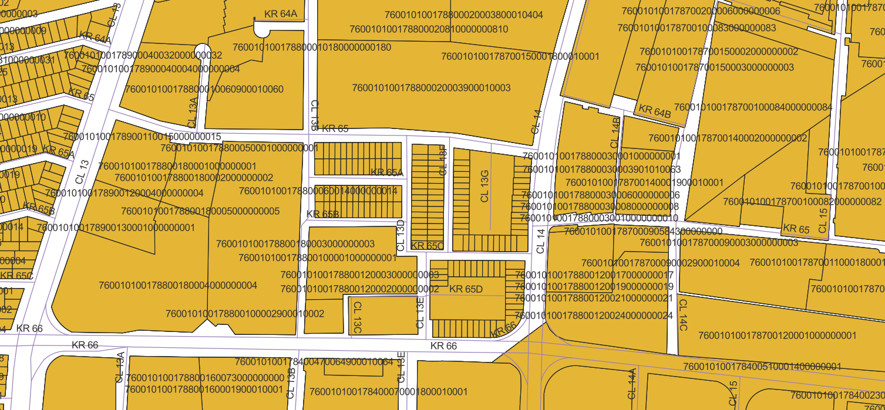

<aside>
<table align="right" style="padding: 1em">
<tr><td>Paquete <big><b>pk0007.01</b></big> de <small><a target="_afacodes" title="Jurisdicción" href="https://afa.codes/CO-VAC-Cali">CO-VAC-Cali</a></small>
</td></tr>
<tr><td>
Donante: <a rel="external" target="_doador" href="https://www.cali.gov.co">Santiago de Cali</a>
 &nbsp; <small>NIT 890399011-3</small> • Wikidata <a rel="external" target="_doador" title="Enlace del descriptor Wikidata del donante" href="https://www.wikidata.org/wiki/Q51103">Q51103</a></small> 
Licencia <a rel="external" target="_doador" href="https://creativecommons.org/publicdomain/zero/1.0/"><b>CC0-1.0</b></a> (cc0 <a title="SHA256 0b0f9b510c5a82125edab20161cc36290d0a677d99a03e21392de841a647b5bb.zip" href="http://dl.digital-guard.org/0b0f9b510c5a82125edab20161cc36290d0a677d99a03e21392de841a647b5bb.zip"><code>0b0f9b5...zip</code></a>) 
Obtido via <i></i> em <b>05/04/2022</b> por:
 &nbsp; Avaliação técnica: <a rel="external" target="_gitPerson" title="Usuario de Git" href="https://github.com/crebollobr">crebollobr</a>
 &nbsp; Representação institucional: <a rel="external" target="_gitPerson" title="Usuario de" href="https://github.com/ThierryAJean">ThierryAJean</a> 
</td></tr>
<tr><td>Camadas:    </td></tr>
<tr><td>Datos publicados en <a href="https://git.digital-guard.org/preservCutGeo-CO2021/tree/main/data/VAC/Cali/_pk0007.01">preservCutGeo-CO2021</a> <a href="#reproducibilidad">Reproducible</a></td></tr>
<tr><td>Visualización:    </td></tr>
</table>
</aside>

<section>

Este repositorio de metadatos describe un paquete de archivos donados al dominio público. Está siendo conservado por Digital Guard: para obtener más detalles, consulte la [documentación sobre el proceso de registro y conservación](https://wiki.addressforall.org/doc/Documentação_Digital-guard).

Nota. Este documento README fue generado por software a partir de la información contenida en el archivo [`make_conf.yaml`](https://git.digital-guard.org/preserv-CO/blob/main/data/VAC/Cali/_pk0007.01/make_conf.yaml) en este paquete, e información adicional de los catálogos de [donantes](https://git.digital-guard.org/preserv-BR/blob/main/data/donor.csv) y [paquetes](https://git.digital-guard.org/preserv-BR/blob/main/data/donatedPack.csv).

# Capas de datos

Los archivos contienen "capas de datos" temáticas. Los metadatos también describen cómo se evaluó cada capa y cómo se filtraron sus datos de forma estandarizada.

##  nsvia

Nombre del archivo: `['BASE_012022.shp/ARCEDITOR01_R_MANZANAS', 'BASE_012022.shp/ARCEDITOR01_MANZANAS_U']` *Descarga* e integridad: [a3070e1b3136cae6068a6ecdd1f0b665d4b1430ca83429553db29ae72658e1f0.zip](http://dl.digital-guard.org/a3070e1b3136cae6068a6ecdd1f0b665d4b1430ca83429553db29ae72658e1f0.zip) Descripción: Arquivo convertido para shapefile BASE_012022.shp.zip Tamaño del archivo: 489671577 bytes (466.99 <abbr title="mebibyte">MiB</abbr>) Formato: shp SRID: +proj=col_urban +lat_0=3.44188333333333 +lon_0=-76.5205625 +x_0=1061900.18 +y_0=872364.63 +h_0=1000 +ellps=GRS80 +towgs84=0,0,0,0,0,0,0 +units=m +no_defs +type=crs

#### Otros datos relevantes
* `IDMANZANA`
* `IDBARRIOS`
* `DEPAPRED`
* `MUNIPRED`
* `TIPO_AVALU`
* `SECTOR`
* `COMUNA`
* `BARRIO`
* `MANZANA`
* `OBS`

#### Filtrado de resultados y su publicación
20568936 bytes (19.62 <abbr title="mebibyte">MiB</abbr>) 15270 polígonos con 448.22 <abbr title="quilômetros quadrados">km²</abbr> densidad media: 0.71 polígonos/km² GeoJSONs publicados em [https://git.digital-guard.org/preservCutGeo-CO2021/tree/main/data/VAC/Cali/_pk0007.01/nsvia](https://git.digital-guard.org/preservCutGeo-CO2021/tree/main/data/VAC/Cali/_pk0007.01/nsvia)

#### Visualización
[https://viz.addressforall.org/CO-VAC-Cali/_pk0007.01/nsvia](https://viz.addressforall.org/CO-VAC-Cali/_pk0007.01/nsvia)
##  parcel

Nombre del archivo: `['BASE_012022.shp/ARCEDITOR01_R_TERRENO', 'BASE_012022.shp/ARCEDITOR01_TERRENOS_U']` *Descarga* e integridad: [a3070e1b3136cae6068a6ecdd1f0b665d4b1430ca83429553db29ae72658e1f0.zip](http://dl.digital-guard.org/a3070e1b3136cae6068a6ecdd1f0b665d4b1430ca83429553db29ae72658e1f0.zip) Descripción: Arquivo convertido para shapefile BASE_012022.shp.zip Tamaño del archivo: 489671577 bytes (466.99 <abbr title="mebibyte">MiB</abbr>) Formato: shp SRID: +proj=col_urban +lat_0=3.44188333333333 +lon_0=-76.5205625 +x_0=1061900.18 +y_0=872364.63 +h_0=1000 +ellps=GRS80 +towgs84=0,0,0,0,0,0,0 +units=m +no_defs +type=crs

#### Datos relevantes
* `NPN` (hnum)

#### Otros datos relevantes
* `DEPAPRED`
* `MUNIPRED`
* `SECTOR`
* `COMUNA`
* `BARRIO`
* `MANZANA`
* `TERRENO`
* `PREDIO`
* `NUMEPRED`
* `NOM_EDIFIC`
* `ETIQUETA`
* `CONEXION`

#### Filtrado de resultados y su publicación
130258311 bytes (124.22 <abbr title="mebibyte">MiB</abbr>) 345901 polígonos con 491.68 <abbr title="quilômetros quadrados">km²</abbr> densidad media: 0.67 polígonos/km² GeoJSONs publicados em [https://git.digital-guard.org/preservCutGeo-CO2021/tree/main/data/VAC/Cali/_pk0007.01/parcel](https://git.digital-guard.org/preservCutGeo-CO2021/tree/main/data/VAC/Cali/_pk0007.01/parcel)

#### Visualización
[https://viz.addressforall.org/CO-VAC-Cali/_pk0007.01/parcel](https://viz.addressforall.org/CO-VAC-Cali/_pk0007.01/parcel)
##  via

Nombre del archivo: `POT_2014.gdb_arcgis_10.5/Ejesviales/bcs_nomenclatura_ejes_viales` *Descarga* e integridad: [e42148b3fc8a262446d16e7e48aa95fcb000d0fab0ffcd35d2523b566becfcf1.zip](http://dl.digital-guard.org/e42148b3fc8a262446d16e7e48aa95fcb000d0fab0ffcd35d2523b566becfcf1.zip) Descripción: POT_2014.gdb_arcgis_10.5.zip Tamaño del archivo: 600829688 bytes (573 <abbr title="mebibyte">MiB</abbr>) Formato: shp SRID: +proj=col_urban +lat_0=3.44188333333333 +lon_0=-76.5205625 +x_0=1061900.18 +y_0=872364.63 +h_0=1000 +ellps=GRS80 +towgs84=0,0,0,0,0,0,0 +units=m +no_defs +type=crs

#### Datos relevantes
* `NOMBRE` (via)

#### Otros datos relevantes
* `NOM_ALTERN`

#### Filtrado de resultados y su publicación
2220676 bytes (2.12 <abbr title="mebibyte">MiB</abbr>) 10560 segmentos con 2867.03 <abbr title="quilômetros">km</abbr> densidad media: 4.98 segmentos/km² GeoJSONs publicados em [https://git.digital-guard.org/preservCutGeo-CO2021/tree/main/data/VAC/Cali/_pk0007.01/via](https://git.digital-guard.org/preservCutGeo-CO2021/tree/main/data/VAC/Cali/_pk0007.01/via)

#### Visualización
[https://viz.addressforall.org/CO-VAC-Cali/_pk0007.01/via](https://viz.addressforall.org/CO-VAC-Cali/_pk0007.01/via)

# Evidencia de prueba

# Comentarios generales
O arquivo BASE_012022.gdb.rar foi convertido para BASE_012022.shp.zip usando o ogr2ogr ( docker run --rm --network host -v /tmp:/tmp osgeo/gdal ogr2ogr /tmp/carlos2/BASE_012022.shp BASE_012022.gdb )

</section>
<section>

# Reproducibilidad

Consulte los detalles en [reproducibility.sh](https://git.digital-guard.org/preserv-CO/blob/main/data/VAC/Cali/_pk0007.01/reproducibility.sh).

</section>

