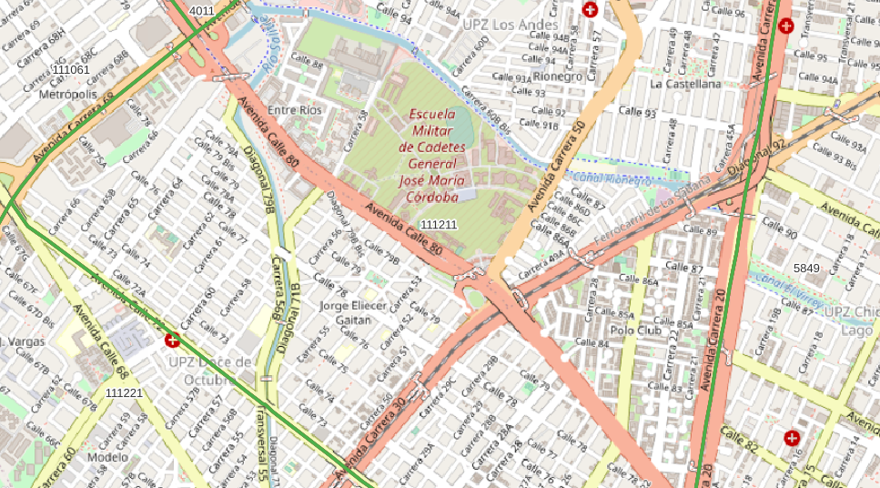

<aside>
<table align="right" style="padding: 1em">
<tr><td>Paquete <big><b>pk0005.01</b></big> de <small><a target="_afacodes" title="Jurisdicción" href="https://afa.codes/CO">CO</a></small>
</td></tr>
<tr><td>
Donante: <a rel="external" target="_doador" href="http://visor.codigopostal.gov.co/472/visor/">SERVICIOS POSTALES NACIONALES S.A. 4-72</a>
 &nbsp; <small>NIT 900.062.917-9</small> • Wikidata <a rel="external" target="_doador" title="Enlace del descriptor Wikidata del donante" href="https://www.wikidata.org/wiki/Q85800448">Q85800448</a></small> 
Licencia <a rel="external" target="_doador" href="http://visor.codigopostal.gov.co/472/visor/Clausula_Licencia_Abierta.pdf"><b>Licencia-codigopostal.gov.co</b></a> (CC-BY? <a title="SHA256 7502b5c3cd701ac21c126c8d6e133bcf2d082e7d08e37acf7d1977e636e0488c.zip" href="http://dl.digital-guard.org/7502b5c3cd701ac21c126c8d6e133bcf2d082e7d08e37acf7d1977e636e0488c.zip"><code>7502b5c...zip</code></a><a title="SHA256 https://web.archive.org/web/20210907144722/http://visor.codigopostal.gov.co/472/visor/Clausula_Licencia_Abierta.pdf" href="https://web.archive.org/web/20210907144722/http://visor.codigopostal.gov.co/472/visor/Clausula_Licencia_Abierta.pdf"><code>webarchive</code></a>) 
Obtido via <i>site</i> em <b>12/07/2021</b> por:
 &nbsp; Avaliação técnica: <a rel="external" target="_gitPerson" title="Usuario de Git" href="https://github.com/crebollobr">crebollobr</a>
 &nbsp; Representação institucional: <a rel="external" target="_gitPerson" title="Usuario de" href="https://github.com/ThierryAJean">ThierryAJean</a> 
</td></tr>
<tr><td>Camadas:  </td></tr>
<tr><td>Datos publicados en <a href="https://git.digital-guard.org/preservCutGeo-CO2021/tree/main/data/_pk0005.01">preservCutGeo-CO2021</a> <a href="#reproducibilidad">Reproducible</a></td></tr>
<tr><td>Visualización:  </td></tr>
</table>
</aside>

<section>

Este repositorio de metadatos describe un paquete de archivos donados al dominio público. Está siendo conservado por Digital Guard: para obtener más detalles, consulte la [documentación sobre el proceso de registro y conservación](https://wiki.addressforall.org/doc/Documentação_Digital-guard).

Nota. Este documento README fue generado por software a partir de la información contenida en el archivo [`make_conf.yaml`](https://git.digital-guard.org/preserv-CO/blob/main/data/_pk0005.01/make_conf.yaml) en este paquete, e información adicional de los catálogos de [donantes](https://git.digital-guard.org/preserv-BR/blob/main/data/donor.csv) y [paquetes](https://git.digital-guard.org/preserv-BR/blob/main/data/donatedPack.csv).

# Capas de datos

Los archivos contienen "capas de datos" temáticas. Los metadatos también describen cómo se evaluó cada capa y cómo se filtraron sus datos de forma estandarizada.

##  nsvia

Nombre del archivo: `Codigo_Postal/CODIGO_POSTAL_COMPLETA` *Descarga* e integridad: [121d26a488ae9b2dd73e72e2d9495a9b892ca3068b95fe969fc64610d7615ff8.zip](http://dl.digital-guard.org/121d26a488ae9b2dd73e72e2d9495a9b892ca3068b95fe969fc64610d7615ff8.zip) Descripción: Codigo Postal Completa Tamaño del archivo: 68521569 bytes (65.35 <abbr title="mebibyte">MiB</abbr>) Formato: shp SRID: 4326

#### Otros datos relevantes
* `codigo`
* `codigo_pos`

#### Filtrado de resultados y su publicación
96158824 bytes (91.7 <abbr title="mebibyte">MiB</abbr>) 3557 polígonos con 535298.51 <abbr title="quilômetros quadrados">km²</abbr> densidad media: 0.76 polígonos/km² GeoJSONs publicados em [https://git.digital-guard.org/preservCutGeo-CO2021/tree/main/data/_pk0005.01/nsvia](https://git.digital-guard.org/preservCutGeo-CO2021/tree/main/data/_pk0005.01/nsvia)

#### Visualización
[https://viz.addressforall.org/CO/_pk0005.01/nsvia](https://viz.addressforall.org/CO/_pk0005.01/nsvia)

# Evidencia de prueba

</section>
<section>

# Reproducibilidad

Consulte los detalles en [reproducibility.sh](https://git.digital-guard.org/preserv-CO/blob/main/data/_pk0005.01/reproducibility.sh).

</section>

