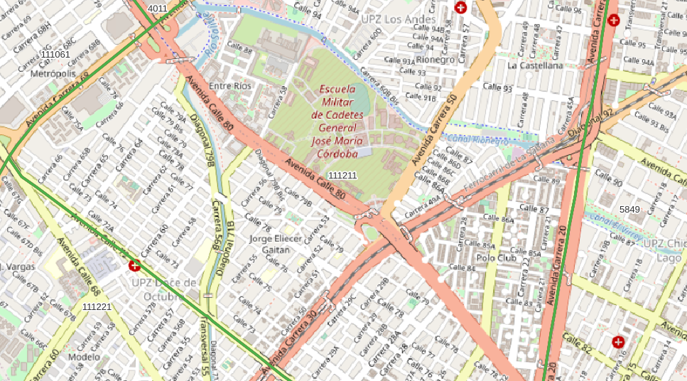

# Tareas
  

Encontrar una solución para mapear códigos postales extendidos

# Extracción
A continuación se muestran los pasos para la extracción por tipo de datos relevantes.
## nsvia
SRID:  4326
1. Abrir`Shapefile_Codigo_Postal.zip`.
2. Selecciona archivos `Codigo_Postal/CODIGO_POSTAL_COMPLETA.*`.
3. Copie los archivos seleccionados al directorio de destino.
### Datos relevantes
columnas:
* `codigo`(string):  tipo de via
* `codigo_pos`(string):  nome de via, si es nulo, use otro campo

# Evidências de teste
Teste no QGIS:

# Make

Para generar todas las capas descritas aquí, `make all_layers`. Todos los datos del "original filtrado" se escribirán en las tablas `ingest.layer_file` e` ingest.feature_asis`.

Para la generación de una sola capa o la descarga de datos de otra fuente, o el uso de una base que no sea `ingest1`, use demasiados parámetros. Ejemplo: `make pg_db=ingest2 orig=/tmp/sandOrig nsvia_full`.
